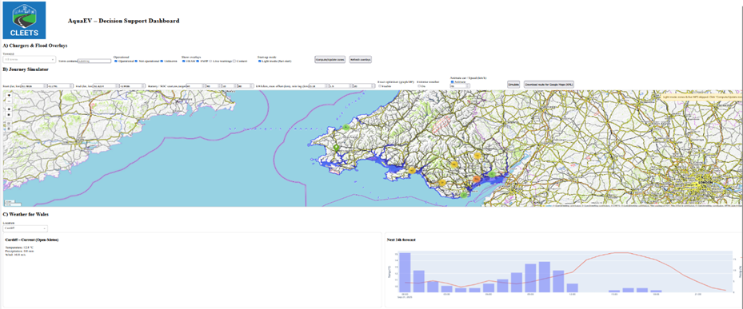

# AquaEV[South Wales] Towards a Decision Support Dashboard for Electric Vehicles Travel Planning During Extreme Events
Vehicles Travel Planning During Extreme Events  
A Dash app that maps EV charging points across South Wales and overlays Welsh Government flood data, live NRW warnings, weather forecasts, and routing analytics.  

# EV Chargers & Flood Risk — South Wales  

[](https://www.python.org/)  
[](https://dash.plotly.com/)  
[](LICENSE)  
[](http://www.nationalarchives.gov.uk/doc/open-government-licence/version/3/)  
[](https://www.openstreetmap.org/copyright)  

A Dash + Folium web app that integrates:  
- **Welsh Government flood-risk maps** (FRAW, FMfP, live warnings via GeoServer).  
- **UK National ChargePoint Registry (NCR) data** for public EV chargers.  
- **Met Office DataHub and Open-Meteo forecasts** for 24-hour conditions.  
- **Journey simulator** with exact RCSP routing + fallback OSRM.  
- **Chatbot explanations** for transparency and scenario testing.  

Chargers are visualised with overlays for flood zones, live warnings, and weather impact.  

---

## Attribution  

Contains Natural Resources Wales information © Natural Resources Wales and database right. All rights reserved.  
Some features of this information are based on digital spatial data licensed from the UK Centre for Ecology & Hydrology © UKCEH.  
Defra, Met Office and DARD Rivers Agency © Crown copyright.  
© Cranfield University. © James Hutton Institute.  
Contains OS data © Crown copyright and database right.[Flood Risk Assessment Wales (FRAW)](https://datamap.gov.wales/layergroups/inspire-nrw:FloodRiskAssessmentWales)  
[Open Government Licence v3.0](https://www.nationalarchives.gov.uk/doc/open-government-licence/version/3/)    
- Contains data from the UK National ChargePoint Registry © OZEV.  
- Weather data © Met Office DataHub / Open-Meteo.  
- Contains OS data © Crown copyright and database right.  

---

## Screenshots  

### Dashboard with flood overlays, journey simulator and weather forecast  
  

---

## Features  
- **Live flood overlays** (FRAW, FMfP, NRW warnings).  
- **EV journey simulator**: RCSP solver (battery-aware) + fallback OSRM routes.  
- **Flood-penalised routing** integrates SOC, range, and reserve margins.  
- **Weather forecasts** from Met Office/Open-Meteo, shown alongside maps.  
- **Interactive chatbot**: explains routing choices and risk exposure.  
- **Downloadable routes** with summaries of time, distance, charging stops, and risk level.  

---

## Repository contents  
- `ons_evapp.py` — single-file Dash app with Folium map, routing, flood overlays, and chatbot interface.  
- `AquaEV.png` — screenshot of the main dashboard.  
- [Colab Notebook] https://colab.research.google.com/drive/1uw6xeN1H6tFmyBEMJUoxDH-qDAU7Hb9a?usp=sharing.
---

## Installation  
```bash
git clone https://github.com/Naeima/AquaEV.git
cd AquaEV
pip install dash pandas geopandas folium shapely requests plotly osmnx
